# ShotCoach architecture

How the product fits together, end to end, with a focus on the core
functionality: the shot-analysis pipeline (uploaded video **and** live
camera), the detection/scoring algorithm, auth, and persistence.

Companion docs: app run instructions in [`../app/README.md`](../app/README.md),
manual validation in [`../app/docs/VALIDATION.md`](../app/docs/VALIDATION.md),
design rationale in [`design-training-app.md`](./design-training-app.md). The
detection & analysis algorithm is explained step by step, with granular
diagrams, in
[`shot-detection-and-analysis.md`](./shot-detection-and-analysis.md); the
command/tooling reference lives in the root [`README`](../README.md).

- [1. System topology](#1-system-topology)
- [2. The analysis stack (shared by both paths)](#2-the-analysis-stack-shared-by-both-paths)
- [3. The shot-analysis algorithm](#3-the-shot-analysis-algorithm)
- [4. Uploaded-video assessment](#4-uploaded-video-assessment)
- [5. Live practice](#5-live-practice)
- [6. Scoring & diagnosis](#6-scoring--diagnosis)
- [7. Authentication & data scoping](#7-authentication--data-scoping)
- [8. Persistence & data model](#8-persistence--data-model)

---

## 1. System topology

The product is two deployables. The app is a **static SPA** — all analysis
runs in the browser; there is no app server. A separate **auth server**
owns identity because credentials can't live in a client-side database.

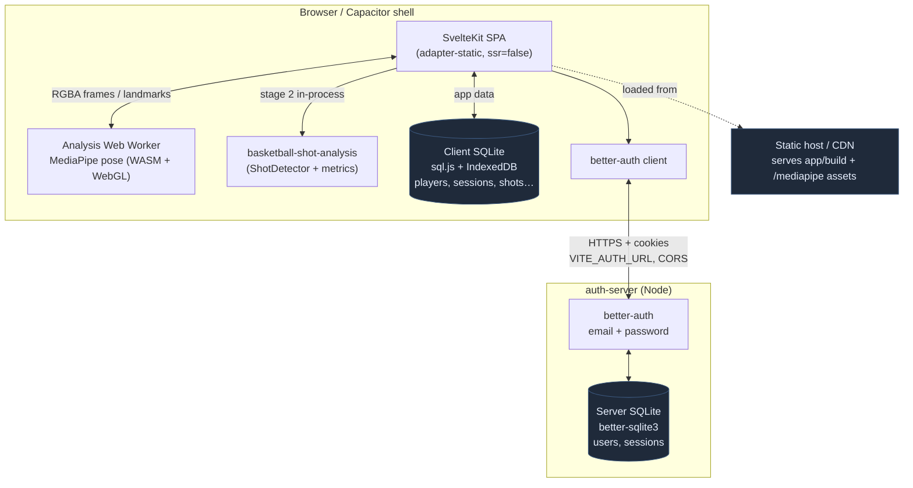

**Why split.** `adapter-static` (required by the Capacitor shells) can't
host server routes, and the app's only database is client-side sql.js —
neither can verify a password or hold a session. So identity gets a small
dedicated Node service and the SPA talks to it over HTTPS with cookies.
Everything else — the entire analysis pipeline and all app data — stays on
the device. See [deviations](../app/docs/deviations.md) for the full
rationale.

---

## 2. The analysis stack (shared by both paths)

Both the uploaded-video and live-camera paths run the **same two stages**
and the **same library code**. Only the orchestration around them differs.

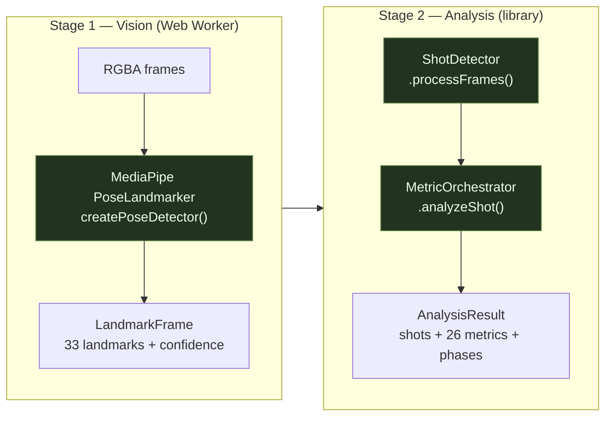

- **Stage 1 (vision)** — `createPoseDetector()` from
  `basketball-shot-analysis`, running MediaPipe tasks-vision (WASM + WebGL)
  inside `app/src/lib/features/analysis/worker/analysis.worker.ts`. Turns
  pixels into `LandmarkFrame`s.
- **Stage 2 (analysis)** — the library's `ShotDetector` +
  `MetricOrchestrator`, driven by one function, `runReplayAnalysis()`
  (`replay/replay-pipeline.ts`). Turns landmarks into detected shots,
  phases, and 26 metrics.

The `?e2e=replay` backend swaps **stage 1** for recorded pose fixtures
(stage 2 is unchanged), which is how the deterministic tests exercise the
real algorithm without a camera.

---

## 3. The shot-analysis algorithm

This is the heart of the product: given a sequence of pose landmarks, find
the shots and measure their form. It lives in the library
(`src/detection`, `src/metrics`) and is identical for uploaded and live.

### 3a. Detection — where is each shot?

`ShotDetector` tracks the **average wrist Y position** over time (screen Y
is down, so _upward_ motion is _negative_ dy) and segments shots from the
velocity profile:

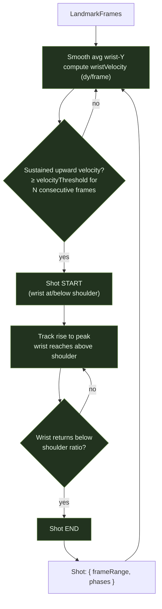

Guards keep it honest: a start requires the wrist to begin at/below
shoulder level (rejects follow-through-only motion), an implausibly large
velocity spike is treated as pose-dropout recovery (ignored), and small
velocity dips don't break an in-progress shot.

### 3b. Phase segmentation — what happens within a shot

Each detected shot is divided into six canonical phases (`ShotPhase`), used
both to anchor metrics and to render key-frame skeleton overlays:

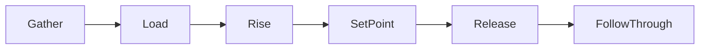

### 3c. Metrics — measure the form

`MetricOrchestrator.analyzeShot()` runs per-phase calculators over the
shot's landmarks to produce **26 metrics** (elbow angle at release, release
height, knee bend, balance, follow-through hold, etc.), each with a
confidence. These flow into scoring ([§6](#6-scoring--diagnosis)).

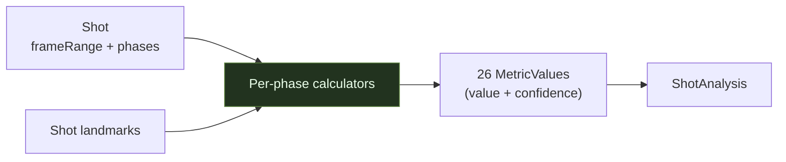

---

## 4. Uploaded-video assessment

Batch, offline, **one** detection pass over the whole clip. The main thread
decodes the file and streams frames to the worker; the worker accumulates
**every** landmark frame, then runs stage 2 over the entire sequence on
`finalize`.

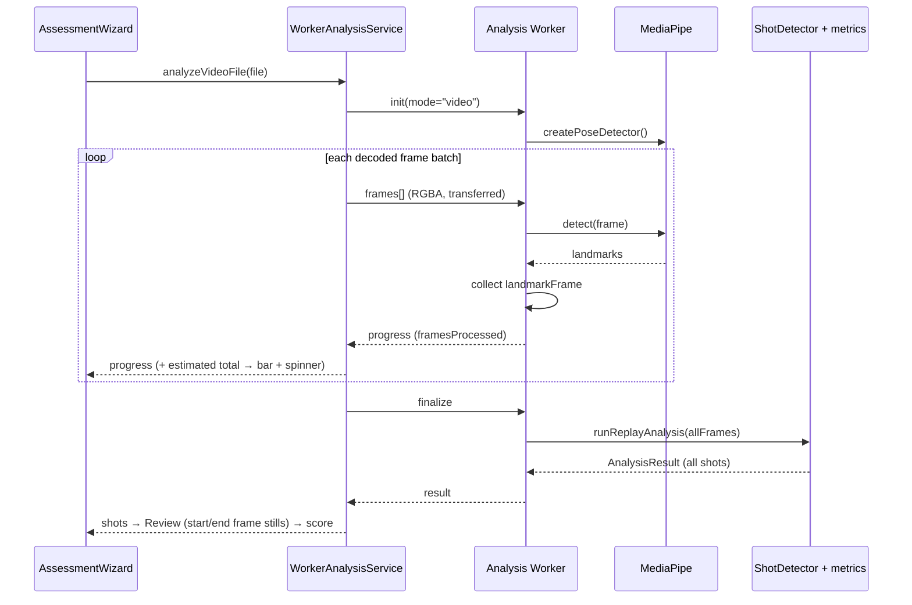

Here the **library `ShotDetector` is the sole authority** on where the
shots are — it sees the whole timeline at once. The worker only knows
frames-so-far, so the service estimates the progress-bar total from the
video's duration × fps.

---

## 5. Live practice

Streaming, real-time. The worker runs in `mode="live"` and streams each
landmark frame straight back — it never accumulates. A **`LiveRepCoordinator`**
state machine (live-only) watches the stream and decides _when_ a rep
probably happened using a cheap wrist-velocity heuristic, then hands a
bounded window to the **same** stage-2 library code to confirm.

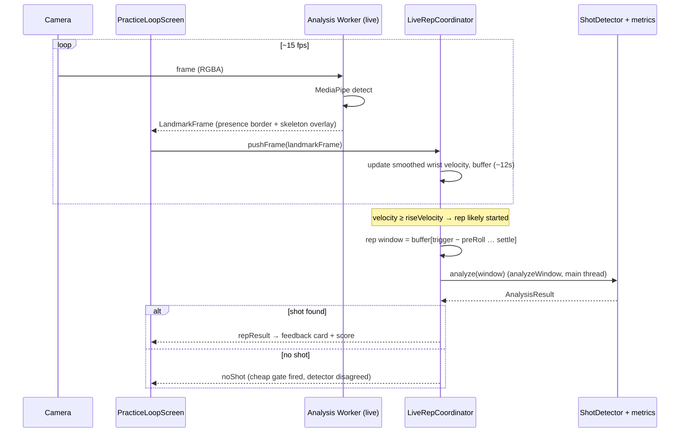

The coordinator's state machine (`live-practice/coordinator/coordinator.ts`),
driven entirely by frame timestamps so replays are deterministic:

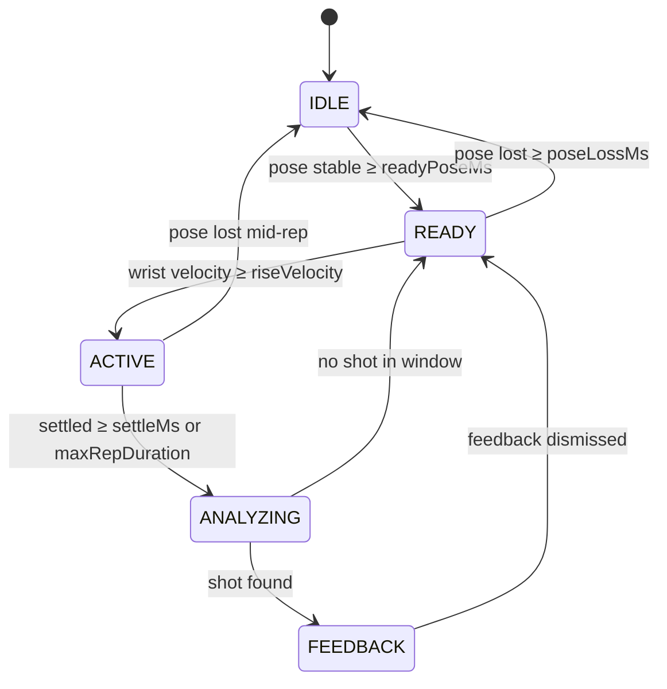

**Two-tier design.** The velocity trigger is a fast, approximate gate
("something shot-like happened, go check"). The library `ShotDetector`
remains ground truth — a window that trips the gate but contains no real
shot returns `noShot`. The reverse (`nearTrigger`) — motion that got close
to the threshold but never crossed it — is surfaced in the debug HUD
(`?debug=live`). This is why a rep can feel like it happened yet produce no
feedback, and it's the observability the HUD exists to expose.

Because live analysis only ever sees a ~12 s window (not the whole
session), the two paths aren't guaranteed bit-identical on the same
footage — but the shot itself sits well inside the window, so detection and
metrics behave the same in practice.

---

## 6. Scoring & diagnosis

Once stage 2 produces shots + metrics, the **app** (not the library) scores
them against a benchmark and diagnoses focus areas. Same code for both
paths.

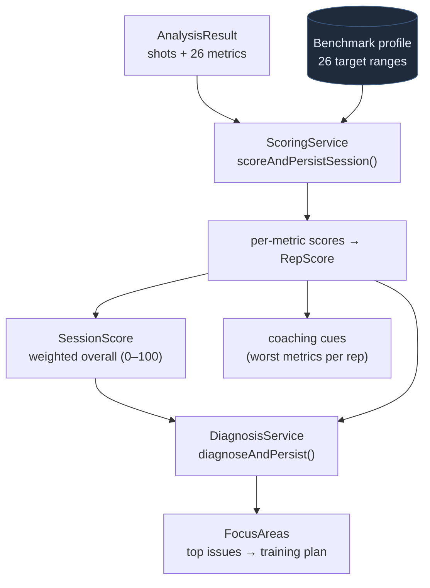

Each metric is compared to the benchmark's target range to produce a 0–100
per-metric score; these weight up into a `RepScore` and a `SessionScore`.
Diagnosis ranks the weakest metrics into `FocusArea`s, which seed the
2-week training plan (drills + focused live sessions) and the
re-assessment loop. The benchmark is currently a placeholder profile
derived from the library's pro-form targets (flagged with a
`PlaceholderBadge` in the UI).

### 6a. Sequencing / Structure scoring (v2)

A second, keyframe-driven scoring path grades a shot on two coach-facing
categories — **Sequencing** (event order + timing) and **Structure** (body
mechanics per phase) — against thresholds derived from pro reference clips.
Unlike the benchmark path above, its "ideal" comes from _what pros actually
have in common_ rather than a hand-set target. Full algorithm:
[`shot-detection-and-analysis.md`](./shot-detection-and-analysis.md).

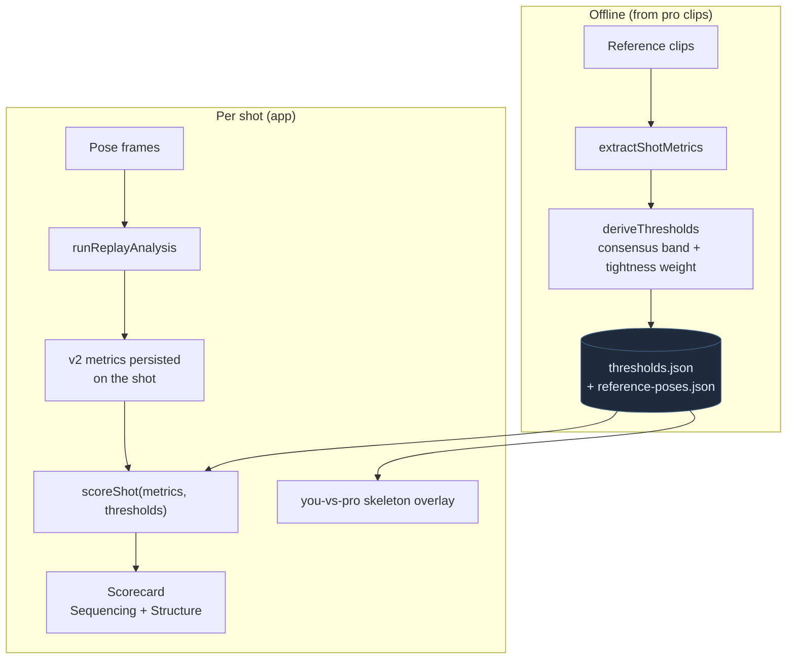

Metrics (not the score) are persisted at analysis time on
`StoredShotAnalysis.v2Metrics`, so re-deriving thresholds from new pro data
re-scores existing shots without re-analysis. Unreliable / missing / reported-
only metrics never affect the score, and the UI surfaces the measured fraction.
Thresholds and reference skeletons are currently **placeholders** built from
`test-data` clips (see [`follow-up-work.md`](./follow-up-work.md)).

---

## 7. Authentication & data scoping

better-auth (email + password) in the auth-server; the SPA uses its client.
A root-layout guard gates every non-`/auth` route on a session, and player
data is scoped to the signed-in user.

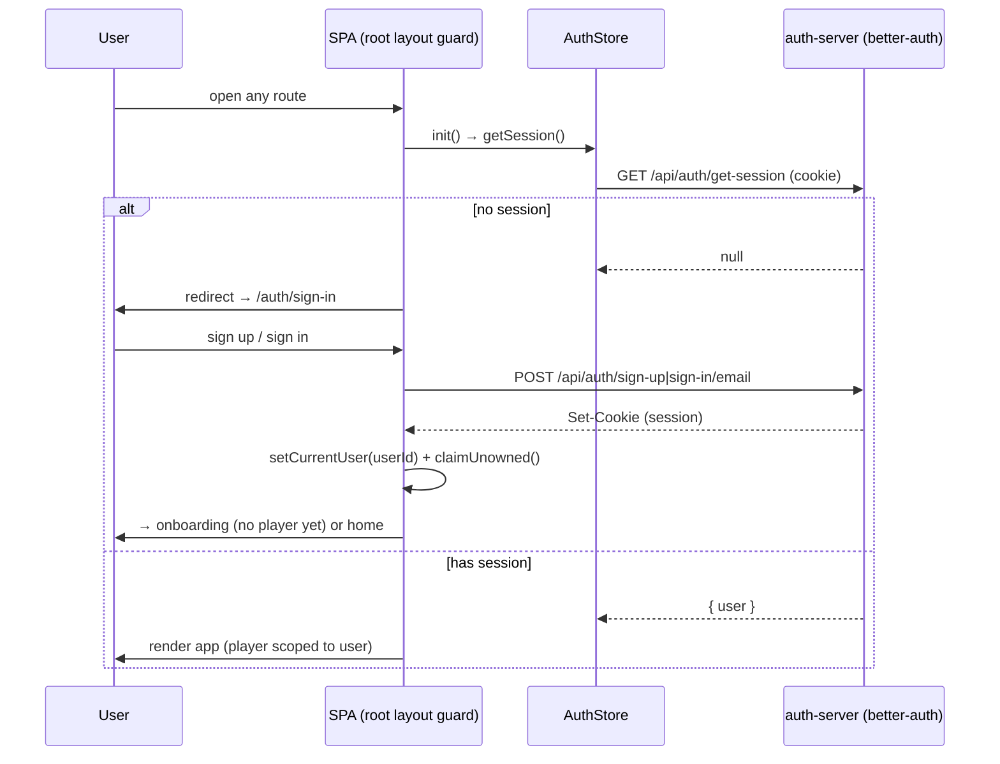

- **Guard**: `app/src/routes/+layout.svelte` — signed-out → `/auth/sign-in`;
  signed-in on an auth page → home. `/__debug/*` excepted.
- **Scoping**: migration 002 adds `players.user_id`; `PlayerRepo` filters
  by the current user. Rows created before auth existed are claimed by the
  first account to sign in. Two accounts on one device keep separate
  players.
- **Flows**: sign-up, sign-in, sign-out, forgot/reset password (token via
  emailed link — logged to console in dev), change password (revokes other
  sessions). Reset-email transport is a stub to replace for production
  (`auth-server/src/auth.js`).

---

## 8. Persistence & data model

Two independent SQLite databases, each owned by the side that can protect
it.

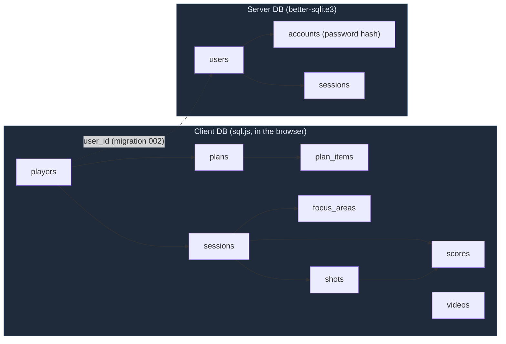

- **Client DB** — the system of record for all app data (players,
  assessment/practice sessions, detected shots + their full `ShotAnalysis`
  JSON, scores, diagnosed focus areas, training plans, videos metadata).
  sql.js in memory, persisted to IndexedDB; migrations run on boot
  (`db/migrations`).
- **Server DB** — identity only (users, sessions, password accounts).
- The only link between them is `players.user_id`, so the browser DB scopes
  app data to the authenticated user without the auth server ever seeing
  shooting data.
