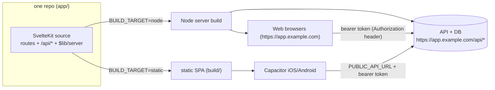

# Hosting & deployment: ShotCoach (web + mobile, one repo)

After the [server migration](./server-migration-plan.md), ShotCoach is **one
SvelteKit repo** that produces **two build artifacts** from the same codebase:

1. **Server build** (`adapter-node`) — the web app **and** the backend API
   (auth + data + analysis) over one server-side database. This is the thing you
   host.
2. **Static SPA build** (`adapter-static`) — a pure client bundle wrapped by
   **Capacitor** for iOS/Android. It has no server of its own; it calls the
   hosted API from #1.

Both talk to the **same backend and the same database**, so a user sees their
data whether they sign in on the web or in the native app.



> **Why two artifacts?** Capacitor ships static files inside the app bundle and
> runs them from the device filesystem — it can't run a Node server. So mobile
> always calls a **remote** API. The web build serves the app and the API
> together. Same source, same API contract, two outputs.

---

## 1. Prerequisites

- Node 20+ and npm.
- A host that can run a long-lived Node process (Fly.io, Render, Railway, a VM,
  a container platform, etc.). Serverless works too but SQLite wants a persistent
  disk — see [§5 Database](#5-database).
- For mobile: Xcode (iOS) and/or Android Studio, plus the Capacitor CLI
  (already a dev dependency).
- A domain with TLS for the API (bearer tokens must only travel over HTTPS; the
  native app requires HTTPS).

---

## 2. Configuration (environment variables)

Set these on the **server** deployment:

| Var                    | Required  | Example                                                          | Notes                                                              |
| ---------------------- | --------- | ---------------------------------------------------------------- | ------------------------------------------------------------------ |
| `AUTH_SECRET`          | ✅ prod   | `openssl rand -base64 32`                                        | better-auth signing secret. Never commit.                          |
| `DATABASE_PATH`        | ✅        | `/data/shotcoach.sqlite`                                         | Single DB file (SQLite). Must be on a **persistent** volume.       |
| `AUTH_TRUSTED_ORIGINS` | ✅        | `https://app.example.com,capacitor://localhost,http://localhost` | Web origin + the two native origins.                               |
| `PORT`                 | –         | `3000`                                                           | adapter-node listen port (default 3000).                           |
| `ORIGIN`               | ✅        | `https://app.example.com`                                        | adapter-node needs the public origin for correct URLs/CSRF.        |
| `MAILER_*`             | prod      | –                                                                | Wire a real transport for `sendResetPassword` (dev logs the link). |
| `AUTH_E2E`             | test only | `1`                                                              | Enables reset-url + db-reset endpoints. **Never set in prod.**     |

Set these at **client build time** (baked into the bundle):

| Var                     | Used by              | Example                   | Notes                                                                       |
| ----------------------- | -------------------- | ------------------------- | --------------------------------------------------------------------------- |
| `BUILD_TARGET`          | build                | `node` \| `static`        | Selects the adapter in `svelte.config.js`.                                  |
| `PUBLIC_API_URL`        | **static/Capacitor** | `https://app.example.com` | Remote API base for the native app. Ignored by the web build (same-origin). |
| `VITE_ANALYSIS_BACKEND` | tests/demo           | `replay`                  | Deterministic analysis for CI/e2e only.                                     |

---

## 3. Deploy the server (web + API)

```bash
cd app
npm ci
BUILD_TARGET=node npm run build:node      # -> build/ (Node server)
# runtime:
AUTH_SECRET=... \
DATABASE_PATH=/data/shotcoach.sqlite \
AUTH_TRUSTED_ORIGINS=https://app.example.com,capacitor://localhost,http://localhost \
ORIGIN=https://app.example.com \
node build                                # serves app + /api/* on $PORT
```

- Put it behind a TLS-terminating reverse proxy (Caddy/nginx/host router).
- Health check: `GET /api/health` → `{ "ok": true }`.
- **Migrations run automatically** on first DB access (Phase 1/3 of the plan);
  no separate migrate step. To wipe (allowed — no data to preserve), delete the
  DB file and restart.

### Container sketch

```dockerfile
FROM node:20-slim
WORKDIR /app
COPY app/package*.json ./
RUN npm ci
COPY app/ ./
RUN BUILD_TARGET=node npm run build:node
ENV PORT=3000
VOLUME /data
CMD ["node", "build"]
```

Mount a persistent volume at `/data` and set `DATABASE_PATH=/data/shotcoach.sqlite`.

---

## 4. Build & ship the static / Capacitor app

The native app is the **static** build pointed at the hosted API.

```bash
cd app
PUBLIC_API_URL=https://app.example.com \
BUILD_TARGET=static \
npm run build:static        # -> build/ (SPA, webDir in capacitor.config.ts)

npx cap sync                # copies build/ into ios/ and android/ shells
```

### iOS

```bash
npx cap open ios            # opens Xcode; set signing team, then Run/Archive
```

### Android

```bash
npx cap open android        # opens Android Studio; Run or build a signed bundle
```

### Auth (one system for web and mobile)

- **All clients use the same auth mechanism: bearer tokens** (better-auth bearer
  plugin), sent as `Authorization: Bearer <token>`. There is no separate
  cookie-based path for web — web and native verify identically on the server
  (`hooks.server.ts`). This avoids WebView third-party-cookie problems and keeps
  cross-origin (native) and same-origin (web) behavior identical.
- The token is stored per platform: `localStorage` on web, Capacitor secure
  storage on native. The wire protocol is the same.
- The native WebView runs at `capacitor://localhost` (iOS) / `http://localhost`
  (Android); these origins plus your web origin must be in `AUTH_TRUSTED_ORIGINS`
  (needed for CORS on the cross-origin native calls).
- All API calls from the native app go to `PUBLIC_API_URL`. Verify with the
  health endpoint from the device during first bring-up.

### Deploy the web SPA without a Node server (optional)

You can also host the **static** build on any static host (Netlify/S3/etc.) and
point it at the API via `PUBLIC_API_URL`, keeping the Node server purely as the
API. Most setups don't need this — the `adapter-node` build already serves the
web app — but it's supported because the client is API-driven.

---

## 5. Database

- Default is a **single SQLite file** (`DATABASE_PATH`) holding better-auth
  tables **and** app tables — the "single unified database" the product wants.
- It **must live on persistent storage**. On ephemeral/serverless filesystems the
  data is lost on redeploy; use a mounted volume or move to a networked DB.
- **Scaling / multi-instance:** SQLite is single-writer. For >1 server instance
  or heavy write concurrency, migrate the server DB layer to Postgres:
  - Swap the `better-sqlite3` driver behind `DatabaseAdapter` for a Postgres
    implementation (the adapter contract in
    `app/src/lib/shared/db/adapter.ts` is the seam) and point better-auth's
    `database` at the same Postgres. App schema/migrations are portable.
  - No client changes — the client only speaks the HTTP API.
- **Backups:** snapshot the SQLite file (or use `sqlite3 .backup`) on a schedule;
  for Postgres use managed backups.

---

## 6. Local development

```bash
# one server: app + API + DB, all in SvelteKit
cd app
AUTH_SECRET=dev-only DATABASE_PATH=./data/dev.sqlite npm run dev
# open http://localhost:5173  (auth, data, and analysis all under /api/*)
```

- No separate auth server anymore.
- To develop the native app against your local server, run the device/emulator
  and set `PUBLIC_API_URL` to your machine's LAN URL (e.g.
  `http://192.168.x.x:5173`) for the `cap sync` build, and add that origin to
  `AUTH_TRUSTED_ORIGINS`.

---

## 7. CI / release checklist

- [ ] `npm run build && npm test` (library) green.
- [ ] `app`: `npm run verify` green (check, lint, unit, build, size, stripped).
- [ ] `app`: `npm run test:e2e` green (single-server journey incl. multi-user
      isolation — see the plan's Phase 9).
- [ ] Root `npm run test:labels` and `npm run metrics:golden` **identical** to
      the pre-migration baseline (analysis output unchanged).
- [ ] Server env set: `AUTH_SECRET`, `DATABASE_PATH` (persistent), `ORIGIN`,
      `AUTH_TRUSTED_ORIGINS`, mailer.
- [ ] `AUTH_E2E` is **unset** in production.
- [ ] `BUILD_TARGET=static` build produced and `npx cap sync` run for the mobile
      release, with `PUBLIC_API_URL` pointing at the deployed API.
- [ ] TLS in front of the API; `/api/health` reachable from web and device.
