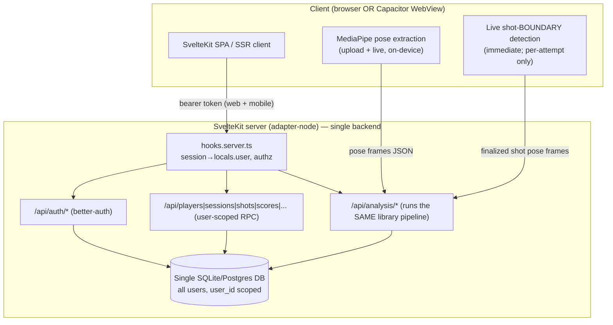

# Server migration plan: unified SvelteKit backend, server-side data & analysis

This plan migrates ShotCoach from **static SPA + separate auth server + on-device
database** to **one SvelteKit repo that serves the app _and_ a single backend
(auth + data + analysis) over one server-side database**. It is written to be
executed by an LLM one step at a time.

## Ground rules for the executor

1. **Work step by step, in order.** Each step has a **Validation** block. Do not
   start the next step until the current step's validation passes.
2. **Do not change the analysis math.** Shot detection, keyframes, metrics, and
   scoring must produce byte-identical results. The migration _moves where the
   deterministic pipeline runs_ (client → server) but runs the **same library
   code** (`basketball-shot-analysis`). The metrics golden
   (`npm run metrics:golden` / `metrics-golden.test.ts`) and `npm run test:labels`
   must not regress.
3. **The database may be wiped.** No production data needs preserving. You may
   drop/recreate schema freely. Do **not** write data-preservation migrations.
4. **Existing tests must still pass** (updated as needed). Prefer updating a test
   to reflect the new architecture over deleting it.
5. **Branch:** do all work on `claude/shooting-form-training-app-zxengy` (or the
   branch in force), commit per step, push when a phase completes.
6. **Commit granularity:** one commit per step, message `server-migration(step N): …`.

## Target architecture

### What moves where

| Concern                                             | Before                                            | After                                                                                                               |
| --------------------------------------------------- | ------------------------------------------------- | ------------------------------------------------------------------------------------------------------------------- |
| Auth                                                | separate `auth-server/` (better-auth, own SQLite) | SvelteKit `/api/auth/*`, same DB                                                                                    |
| User data (players/sessions/shots/scores…)          | on-device SQLite (sql.js / capacitor-sqlite)      | single server DB, `user_id`-scoped                                                                                  |
| Full shot analysis (detect→keyframes→metrics→score) | client (worker/replay)                            | server `/api/analysis/*` (same library code)                                                                        |
| MediaPipe pose extraction                           | client                                            | **stays client** (see decision below)                                                                               |
| Live shot **boundary** detection (immediate)        | client                                            | **stays client** for latency; each attempt's full pose data POSTed to server for detailed analysis (same as static) |

### Key design decisions (read before starting)

- **Pose extraction stays on the client; the deterministic pipeline moves to the
  server — for BOTH upload and live.** The user's framing: "once the pose data is
  identified … send the full pose data for each shot attempt to the backend for
  detailed analysis, just like the static lessons." So the client owns MediaPipe
  pose extraction, and for live it also owns the fast shot-**boundary** detection
  (for immediacy); everything after — keyframes, metrics, scoring — runs on the
  server over the posted pose frames. This also **guarantees identical results**,
  because the server runs the same `runReplayAnalysis`/library code over the same
  pose frames. Server-side MediaPipe (uploading video, running pose detection in
  Node) is deferred to **Appendix A** as an optional later track — it would change
  the MediaPipe runtime and require re-baselining the golden, which conflicts with
  the "identical results" requirement.
- **One unified auth system: bearer tokens for every client (web AND mobile).**
  There is a single auth mechanism, not one for web and another for mobile. All
  clients authenticate with better-auth's **bearer plugin** and send
  `Authorization: Bearer <token>`; `hooks.server.ts` resolves identity from that
  header only. The token is stored per-platform (web: `localStorage` via a small
  token-store abstraction; native: Capacitor secure storage) but the wire
  protocol and server verification are identical. Session cookies are not used by
  the app — this keeps cross-origin (Capacitor → API) and same-origin (web → API)
  behavior identical and sidesteps WebView third-party-cookie issues entirely.
- **One repo, two build targets.** `adapter-node` produces the server (web app +
  API). `adapter-static` (SPA) produces the Capacitor bundle, which points at the
  remote API via `PUBLIC_API_URL`. The adapter is chosen by a `BUILD_TARGET`
  env var in `svelte.config.js`. This is covered in
  [`hosting-and-deployment.md`](./hosting-and-deployment.md).
- **Repo interfaces are the seam.** The domain services (assessment, scoring,
  progress…) consume `AppRepos` interfaces
  (`app/src/lib/shared/config/services.ts`). Server routes reuse the **existing
  repo implementations** (`app/src/lib/shared/db/repos/*`) over `better-sqlite3`.
  The client gets a **remote (fetch-backed) implementation of the same
  interfaces**, so domain services and components don't change.

---

## Phase 0 — Repo prep & shared boundaries

### Step 0.1 — Baseline green

**Goal:** capture a known-good baseline so regressions are attributable.

**Steps:**

- From repo root: `npm run build` (library), `npm test` (library).
- In `app/`: `npm run check && npm test && npm run build`.
- Record current results of `npm run test:labels` and `npm run metrics:golden`
  (they must remain identical at the end).

**Validation:** all of the above pass. Save the `test:labels` set_point/summary
lines to compare later.

### Step 0.2 — Decide server module layout

**Goal:** a place for server-only code that SvelteKit will tree-shake out of the
client bundle.

**Steps:**

- Create the directory `app/src/lib/server/` (SvelteKit guarantees anything under
  `$lib/server` and `*.server.ts` never reaches the client).
- Add a short `app/src/lib/server/README.md` describing: DB singleton, auth,
  repo factory, analysis runner live here; nothing here may be imported by
  client code.

**Validation:** `npm run check` passes (no imports yet).

---

## Phase 1 — Server runtime foundation

### Step 1.1 — Environment-switched adapter

**Goal:** build a Node server for web/API, and a static SPA for Capacitor, from
one config.

**Steps:**

- Install `@sveltejs/adapter-node` in `app/`.
- Edit `app/svelte.config.js` to select the adapter by `process.env.BUILD_TARGET`:
  - `BUILD_TARGET=static` (or unset in Capacitor builds) → `adapter-static`
    with `fallback: "index.html"` (current behavior).
  - `BUILD_TARGET=node` → `adapter-node`.
- Ensure server routes are allowed: when building static, server `+server.ts`
  routes are simply not emitted (the SPA calls the remote API). Confirm no route
  is force-prerendered.

**Validation:**

- `BUILD_TARGET=node npm run build` produces a Node server build.
- `BUILD_TARGET=static npm run build` produces the static SPA (as today).
- `npm run check` passes.

### Step 1.2 — Server DB singleton + migrations on boot

**Goal:** one server-side database, migrated at startup.

**Steps:**

- Add `app/src/lib/server/db.ts`: construct the **existing** `better-sqlite3`
  driver (`app/src/lib/shared/db/drivers/better-sqlite3.ts`) as a lazily-created
  singleton, path from `DATABASE_URL`/`DATABASE_PATH` env (default
  `./data/shotcoach.sqlite`). Export `getDb(): Promise<DatabaseAdapter>`.
- On first access, run `migrate(db)` (reuse `app/src/lib/shared/db/migrations`).
- Add `data/` to `.gitignore` if not already.

**Validation:**

- Add `app/src/lib/server/__tests__/db.server.test.ts`: opens the singleton,
  migrates, runs a trivial `SELECT 1`, asserts the schema tables exist.
- `npm test` passes.

### Step 1.3 — Health endpoint

**Goal:** a liveness route to replace the old auth-server `/health`.

**Steps:**

- Add `app/src/routes/api/health/+server.ts` returning `{ ok: true }` and
  touching `getDb()` so it fails if the DB can't open.

**Validation:** `BUILD_TARGET=node npm run build && node build` then
`curl localhost:3000/api/health` → `{"ok":true}`. Add a test that imports the
`GET` handler and asserts a 200 JSON body.

---

## Phase 2 — Auth in SvelteKit (retire `auth-server/`)

### Step 2.1 — Port better-auth into the app server

**Goal:** better-auth runs inside SvelteKit against the single DB.

**Steps:**

- Add `app/src/lib/server/auth.ts` mirroring `auth-server/src/auth.js`:
  `betterAuth({ database: <better-sqlite3 handle>, emailAndPassword, secret,
baseURL, basePath: "/api/auth", trustedOrigins })`.
  - Use the **same** better-sqlite3 file as `getDb()` (better-auth manages its
    own tables in that file; keep app tables separate).
  - Add the **bearer plugin** (`better-auth/plugins` → `bearer()`) — this is the
    single auth mechanism for **all** clients (web and mobile), not a mobile-only
    add-on. Configure sessions to be returned as a bearer token on sign-in/up.
  - Keep `sendResetPassword` pluggable (dev logs the URL as today; prod wires a
    real mailer — leave a `// TODO(mailer)` and env hook).
- Run better-auth's migrations at boot (reuse the `getMigrations`/`runMigrations`
  pattern from `auth-server/src/auth.js`).

**Validation:** `app/src/lib/server/__tests__/auth.server.test.ts` constructs the
auth instance against a temp DB, runs migrations, and asserts the auth tables
(`user`, `session`, `account`, `verification`) exist.

### Step 2.2 — Mount the auth handler + session hook

**Goal:** expose `/api/auth/*` and resolve the caller's identity for every
request.

**Steps:**

- Add `app/src/routes/api/auth/[...all]/+server.ts` delegating `GET`/`POST` to
  better-auth's handler (`auth.handler(event.request)`).
- Add `app/src/hooks.server.ts`:
  - Resolve the session from the `Authorization: Bearer` header via
    `auth.api.getSession({ headers })`; set `event.locals.user`/`session`. This
    is the single identity path for every client — no cookie branch.
  - Add CORS for cross-origin origins (`capacitor://localhost`, `http://localhost`,
    and the configured web origin) — reflect allowed origins and handle `OPTIONS`.
    Allow the `Authorization` request header.
- Add `app/src/app.d.ts` `Locals` typing for `user`/`session`.

**Validation:**

- Port the `auth-server/src-tests/server.test.js` cases to
  `app/src/routes/api/auth/__tests__/auth-routes.test.ts`: sign-up, sign-in
  (bearer token returned), get-session with the token, sign-out, password reset
  (using the dev reset-url hook). Run against a temp DB.
- `npm test` passes.

### Step 2.3 — Unify the client on bearer tokens (web + mobile)

**Goal:** one auth mechanism for every client — bearer tokens, stored per
platform, sent as `Authorization: Bearer`.

**Steps:**

- Add a tiny `TokenStore` abstraction (`app/src/lib/shared/auth/token-store.ts`)
  with two implementations selected by platform: `localStorage` on web,
  Capacitor secure storage (`@capacitor/preferences` or a secure plugin) on
  native. Same interface both sides.
- Edit `app/src/lib/shared/auth/better-auth-api.ts`:
  - Base URL: same-origin (`""`) on web; `PUBLIC_API_URL` on native
    (`isNative()`).
  - Enable the better-auth **bearer** client plugin for all platforms; on
    sign-in/up, persist the returned token via `TokenStore`; attach it as
    `Authorization: Bearer` on every request; clear it on sign-out.
- Ensure the remote repos and analysis client (Phases 5–7) send the same
  `Authorization` header (share one authed-`fetch` wrapper).
- Update `app/src/lib/shared/auth/auth-store.svelte.ts` only if needed to store
  the token on sign-in and clear it on sign-out.

**Validation:** existing auth unit tests updated and green;
`app/src-tests/e2e/auth.spec.ts` still passes against the new single server
(update `playwright.config` webServer in Step 8.2).

### Step 2.4 — Delete `auth-server/`

**Goal:** remove the retired service.

**Steps:**

- Delete the `auth-server/` directory and its root `package.json` workspace
  reference. Move any prod notes (mailer, secrets) into
  `docs/hosting-and-deployment.md`.

**Validation:** `npm run check` (app) passes; root `npm test` passes; grep shows
no remaining imports of `auth-server`.

---

## Phase 3 — Server schema with user scoping

### Step 3.1 — Add `user_id` to owned tables

**Goal:** every user-owned row is attributable to a user; cross-user reads are
impossible server-side.

**Steps:**

- Since data may be wiped, add a migration (new version) that ensures `user_id`
  exists and is indexed on the **ownership root**. Today ownership flows
  `user → players → (videos, sessions, shots, scores, plans, reps, focus_areas)`.
  Choose ONE and document it:
  - **Recommended:** keep `players.user_id` as the ownership root and enforce it
    in every server query by joining/【scoping through the owning player. Add
    `user_id` **redundantly** to `sessions` and `videos` (the two direct entry
    points) with indexes, to avoid a join on hot paths.
- Update `app/src/lib/shared/db/migrations` with the new migration and bump the
  version. Keep `001`/`002` intact (fresh DBs run all in order).

**Validation:** `db.server.test.ts` asserts the new columns/indexes exist after
migrate.

### Step 3.2 — Server-scoped repo factory

**Goal:** a repo set bound to a specific `user_id`, with ownership enforced on
**every** read/write (closes the `get(id)`/`update(id)` gaps in
`player-repo.ts`).

**Steps:**

- Add `app/src/lib/server/repos.ts`: `createServerRepos(db, userId)` returning
  `AppRepos` where:
  - `create*` stamps `user_id`.
  - `get`/`update`/`list` include `AND user_id = ?` (or an ownership join
    through `players`).
  - Add `assertOwns(entity, userId)` guards that throw a typed
    `ForbiddenError` on mismatch.
- Reuse existing repo SQL where possible; add the scoping clause.
- Remove `claimUnowned` semantics (no pre-auth rows exist server-side).

**Validation:**

- Add `app/src/lib/server/__tests__/repos.isolation.test.ts`: user A creates a
  player+session+shot; user B's repos return **nothing** for A's ids and cannot
  `update`/`delete` them (throws Forbidden). Reuse `better-sqlite3` driver.
- `npm test` passes.

---

## Phase 4 — Data API (user-scoped RPC over repos)

### Step 4.1 — Request context helper

**Goal:** one place to authenticate + build the scoped repos.

**Steps:**

- Add `app/src/lib/server/context.ts`: `requireUser(event)` → returns
  `{ userId, repos }` or throws `401`. Build repos via `createServerRepos(await
getDb(), userId)`.
- Add `app/src/lib/server/http.ts`: `json()`, `error()` helpers and a
  `withUser(handler)` wrapper that maps thrown `Unauthorized`/`Forbidden`/Zod
  errors to 401/403/400.

**Validation:** unit test `withUser` maps errors to the right status codes.

### Step 4.2 — Endpoints per resource

**Goal:** the client can perform every DB operation it needs via HTTP, always
user-scoped.

**Steps:** add `+server.ts` routes under `app/src/routes/api/` mirroring the
repo methods the client uses. Minimum surface (derive exact list from current
client usage — grep `services.repos.` and `s.repos.`):

- `api/players` (GET current, POST create), `api/players/[id]` (GET/PATCH).
- `api/sessions` (GET list-by-current-player, POST create),
  `api/sessions/[id]` (GET, PATCH complete/abort).
- `api/shots` (GET by session, POST create/persist), `api/shots/[id]` (PATCH
  exclude).
- `api/scores`, `api/reps`, `api/videos`, `api/settings`, `api/progress`
  (read models used by the progress screens).
- Validate every request body with **zod** (schemas can live beside each route).
- Every handler uses `requireUser(event)`.

**Validation:**

- Add route integration tests
  (`app/src/routes/api/**/__tests__/*.test.ts`) invoking the exported `GET`/`POST`
  handlers with a signed-in user (inject `locals.user`), asserting persistence
  and per-user isolation.
- `npm test` passes.

---

## Phase 5 — Client remote repo layer (drop on-device DB)

### Step 5.1 — Remote repos implementing `AppRepos`

**Goal:** the client stops storing user data locally and calls the API instead —
without touching domain services.

**Steps:**

- Add `app/src/lib/shared/db/remote/*`: `createRemoteRepos(fetch, baseUrl):
AppRepos` where each repo method is a typed `fetch` to the Phase 4 endpoints
  (shared request/response types with the server via a `contracts/` module so
  both sides stay in sync).
- The remote repos must satisfy the **exact same interfaces** in
  `app/src/lib/shared/db/repos/types.ts`, so `createDomainServices` is unchanged.

**Validation:** add contract tests reusing the existing
`app/src/lib/shared/db/__tests__/adapter-contract.ts` philosophy: run the same
behavioral suite against (a) the in-process server repos and (b) the remote
repos hitting an in-test SvelteKit handler, asserting identical behavior.

### Step 5.2 — Swap the composition root

**Goal:** production client uses remote repos + server analysis; no sql.js/
capacitor-sqlite in the client prod path.

**Steps:**

- Edit `app/src/lib/shared/config/services.ts` `createAppServices`: build
  `repos = createRemoteRepos(fetch, apiBaseUrl())` instead of
  `createDatabase()/createRepos()`. Remove `migrate()` from the client path.
- Keep the sql.js / capacitor-sqlite **drivers** in the tree (server tests and
  the adapter-contract suite still use better-sqlite3), but ensure they are no
  longer imported by the client bundle (dynamic import only from server/tests).
- Update `app/src/routes/+layout.svelte`: remove `setCurrentUser`/`claimUnowned`
  (scoping is now server-side); keep the "redirect to onboarding if the signed-in
  user has no player" check (now via `api/players` GET current).

**Validation:**

- `npm run check` passes.
- `npm run check:size` — confirm sql.js/wasm is no longer in the client bundle
  (bundle should shrink); update the size budget if needed.
- Component/store tests that used `createTestServices` are updated to inject a
  **fake in-memory `AppRepos`** (same interfaces). `npm test` passes.

---

## Phase 6 — Server-side full analysis

### Step 6.1 — Extract a shared analysis runner

**Goal:** run the **existing deterministic pipeline** on the server, producing
the same `ShotAnalysis` + `ShotMetricsV2` as today.

**Steps:**

- The pure pipeline already lives in
  `app/src/lib/features/analysis/replay/replay-pipeline.ts`
  (`runReplayAnalysis`, `computeV2Metrics`) and depends only on
  `basketball-shot-analysis` (Node-safe). Extract the pose-frames→result core
  into a module importable by the server (e.g.
  `app/src/lib/server/analysis.ts` that re-exports/wraps `runReplayAnalysis`).
  Do **not** modify the pipeline logic.

**Validation:** a server test feeds a `test-data` fixture's pose frames through
the server runner and asserts the result **equals** the client replay path for
the same input (deep-equal on keyframes + metrics + v2). This is the
"identical results" guard.

### Step 6.2 — Analysis endpoints

**Goal:** the client sends pose frames; the server runs full analysis, scores,
and persists — all user-scoped.

**Steps:**

- `app/src/routes/api/analysis/shot/+server.ts` (POST): body =
  `{ sessionId, shotIndex, poseData, options }`. Auth via `requireUser`. Run the
  server analysis runner → persist a shot (scoped to the user's session) →
  score → return `{ shot, analysis, v2Metrics, score }`.
- `app/src/routes/api/analysis/session/+server.ts` (POST): a batch variant that
  accepts a full assessment's pose sets, runs each, persists the session +
  shots + scores + focus areas, returns the assembled result the results screen
  needs (mirror what `createAssessmentService` assembles today, but server-side).
- Enforce payload size limits and validate pose JSON with zod.

**Validation:**

- Route tests: POST a fixture's pose frames as a signed-in user → assert the
  persisted shot/score match the deterministic expectation and are readable back
  only by that user.
- Re-run `npm run metrics:golden` / `metrics-golden.test.ts` and
  `npm run test:labels` at the **repo root** (library unchanged) — must match
  the Step 0.1 baseline exactly.

---

## Phase 7 — Wire client flows to the server

### Step 7.1 — Upload (static) analysis flow

**Goal:** upload → client pose extraction → server full analysis → server-stored
results.

**Steps:**

- Keep the client MediaPipe worker (`worker-analysis-service.ts`) for **pose
  extraction only**. After it yields pose frames, call `POST /api/analysis/session`
  instead of persisting locally.
- The `AssessmentService` (`app/src/lib/features/assessment`) now: drive pose
  extraction client-side, hand pose sets to the analysis API, then read the
  assembled results from the response / `api/sessions/[id]`.
- The results screen (`AssessmentResults.svelte`) reads persisted server data via
  the remote repos (no behavior change to the UI).

**Validation:** analysis unit/integration tests updated; the replay e2e
(`analysis.spec.ts`, `assessment.spec.ts`) pass against the single server with
the replay backend.

### Step 7.2 — Live analysis flow

**Goal:** immediate client-side shot-boundary detection; server does the detailed
analysis of each attempt — exactly the static-lesson path, applied per rep.

**Steps:**

- Client-side **pose extraction + fast shot-boundary detection** (immediate
  feedback) is **unchanged** for latency (`live-session-store.svelte.ts`,
  `worker-analysis-service` live path). This client step only decides "a shot
  attempt happened, here are its frames" — it does not compute the detailed
  metrics/score.
- When an attempt's boundary is identified, POST that attempt's **full pose
  frames** to `POST /api/analysis/shot` — the same endpoint and same server
  pipeline the static/upload flow uses. Use the server response for the
  authoritative persisted score and history.
- The live overlay may still show a lightweight client cue for instant feedback,
  but the **stored, authoritative** result always comes from the server (so live
  and static reps are analyzed identically).

**Validation:** `live-practice.spec.ts` / `live-debug.spec.ts` pass; a new test
asserts the finalized rep is persisted server-side and visible in progress.

---

## Phase 8 — Cleanup, tests, config

### Step 8.1 — Migrate remaining tests

**Goal:** all suites reflect the new architecture and pass.

**Steps:**

- Replace `db.spec.ts` (client DB) assertions with server-DB equivalents or
  API-level checks.
- Ensure the adapter-contract suite runs against `better-sqlite3` (server) as the
  canonical driver.
- Update `createTestServices` to build fake in-memory `AppRepos`.

**Validation:** `npm test` (app) and root `npm test` fully green.

### Step 8.2 — Playwright web server + envs

**Goal:** e2e runs against the single SvelteKit server (no separate auth-server).

**Steps:**

- Edit `app/playwright.config.ts`: replace the two `webServer` entries (preview +
  auth-server on 5174) with a **single** `BUILD_TARGET=node` server that serves
  app + API on one port, seeded with `VITE_E2E=1`/`VITE_ANALYSIS_BACKEND=replay`
  and a throwaway DB (`DATABASE_PATH=./.e2e/db.sqlite`, deleted before run).
- Add a test-only reset endpoint gated by `AUTH_E2E=1` (drop+remigrate) so each
  spec starts clean, mirroring the old reset-url hook.

**Validation:** `npm run test:e2e` boots one server and the existing specs pass.

### Step 8.3 — Docs & scripts

**Goal:** repo reflects the new topology.

**Steps:**

- Update root `README.md`, `docs/architecture.md`, `docs/follow-up-work.md` (the
  2.x auth/data-scoping items are now resolved), and workspaces in root
  `package.json` (drop `auth-server`).
- Add `app` scripts: `build:node` (`BUILD_TARGET=node vite build`),
  `build:static` (`BUILD_TARGET=static vite build`), `start` (`node build`).

**Validation:** `npm run verify` (app) passes end-to-end.

---

## Phase 9 — End-to-end user-flow validation (Playwright)

### Step 9.1 — Full-journey spec with data isolation

**Goal:** prove the whole system multi-user, cross-device, and isolated.

Add `app/src-tests/e2e/server-journey.spec.ts` (replay analysis backend, single
node server). Cover, as one narrative plus isolation checks:

1. **User A sign-up** → onboarding creates player A.
2. **Static analysis:** upload a fixture → client extracts poses → server
   analyzes → results screen shows the scorecard; assert a shot/score row exists
   for A via the API.
3. **Live analysis:** run a replay live session → finalize a shot → assert the
   rep/score is persisted server-side and appears in Progress.
4. **Review past results:** navigate Progress → open the session → scorecard
   renders from server data.
5. **Logout** → auth screens; protected API calls now 401.
6. **Second device (fresh browser context), User A login** → sees the **same**
   data (server-backed, not device-local).
7. **User B sign-up on a fresh context** → sees **none** of A's players/sessions/
   shots (isolation). Attempt to GET one of A's known ids → 403/404.
8. **Password reset** happy path via the dev reset hook (optional but
   recommended).

**Validation:**

- `npm run test:e2e` green, including the new spec.
- Root `npm run test:labels` and `npm run metrics:golden` identical to the
  Step 0.1 baseline (analysis unchanged).
- `npm run verify` (app) green.

### Step 9.2 — Final regression sweep

- Root: `npm run build && npm test`.
- `app`: `npm run verify && npm run test:e2e`.
- Confirm `BUILD_TARGET=static npm run build` still yields a Capacitor-ready SPA
  (Phase covered by `hosting-and-deployment.md`), and `npx cap sync` succeeds.

---

## Appendix A — Optional: server-side MediaPipe pose extraction (later track)

Deferred because it conflicts with "identical results." If you later want the
device to do **zero** heavy work on upload:

- Add `POST /api/analysis/video` accepting an uploaded clip; run MediaPipe in
  Node (or a sidecar pose microservice) to produce pose frames, then the same
  deterministic runner.
- **Re-baseline** the metrics golden and `test:labels` against the server's
  MediaPipe build (results will shift because the pose numbers change). Gate this
  behind a new golden and document the version.
- Consider cost/latency: video upload + server pose inference is far heavier than
  shipping pose JSON. Keep the client-pose path as the default for live.

## Appendix B — API surface (reference)

| Method & path                                                                        | Auth   | Purpose                                      |
| ------------------------------------------------------------------------------------ | ------ | -------------------------------------------- |
| `ALL /api/auth/*`                                                                    | public | better-auth (sign-up/in/out, reset, session) |
| `GET /api/health`                                                                    | public | liveness                                     |
| `GET/POST /api/players`, `GET/PATCH /api/players/[id]`                               | user   | current player, create, update               |
| `GET/POST /api/sessions`, `GET/PATCH /api/sessions/[id]`                             | user   | list/create/complete sessions                |
| `GET/POST /api/shots`, `PATCH /api/shots/[id]`                                       | user   | shots by session, persist, exclude           |
| `GET/POST /api/scores`, `/api/reps`, `/api/videos`, `/api/settings`, `/api/progress` | user   | remaining read/write models                  |
| `POST /api/analysis/shot`                                                            | user   | full analysis of one shot's poses + persist  |
| `POST /api/analysis/session`                                                         | user   | full analysis of an assessment + persist     |

## Appendix C — Environment variables

| Var                              | Where           | Purpose                                                       |
| -------------------------------- | --------------- | ------------------------------------------------------------- |
| `BUILD_TARGET`                   | build           | `node` (server) or `static` (Capacitor SPA)                   |
| `DATABASE_PATH` / `DATABASE_URL` | server          | single DB location                                            |
| `AUTH_SECRET`                    | server          | better-auth signing secret (required in prod)                 |
| `AUTH_TRUSTED_ORIGINS`           | server          | comma-separated allowed origins incl. `capacitor://localhost` |
| `PUBLIC_API_URL`                 | client (native) | remote API base for Capacitor builds                          |
| `VITE_ANALYSIS_BACKEND`          | build/e2e       | `replay` for deterministic tests                              |
| `AUTH_E2E`                       | server (test)   | enables reset-url + db-reset endpoints                        |

See [`hosting-and-deployment.md`](./hosting-and-deployment.md) for how these are
set per deployment.
