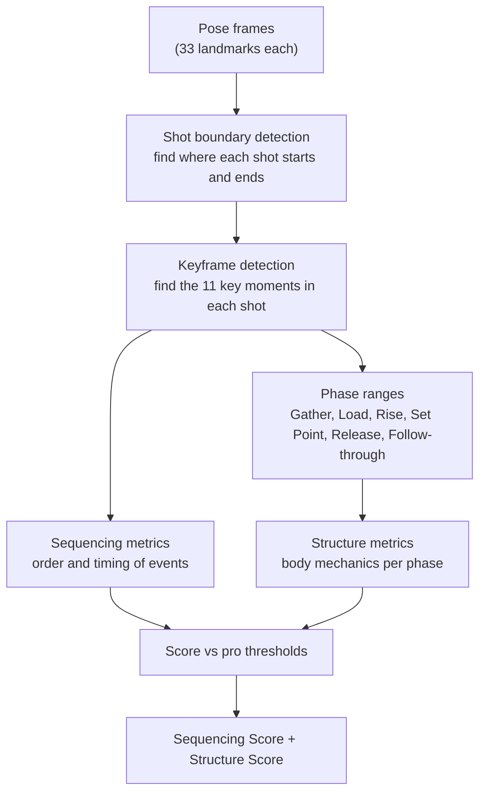
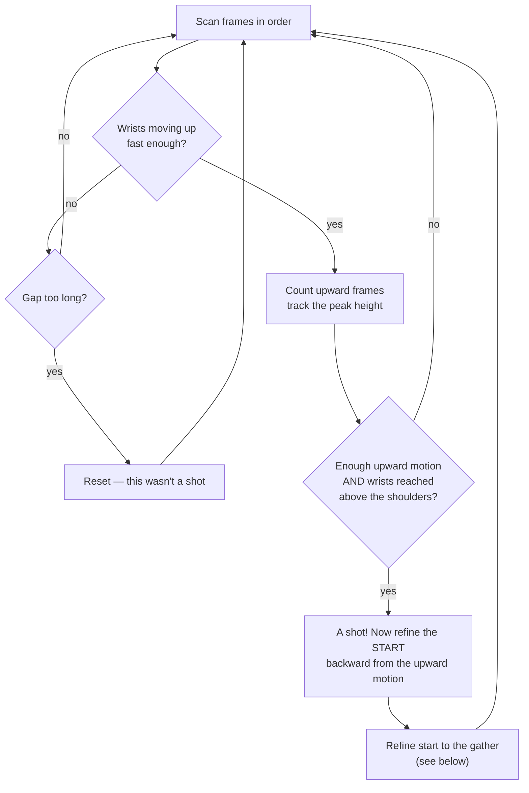
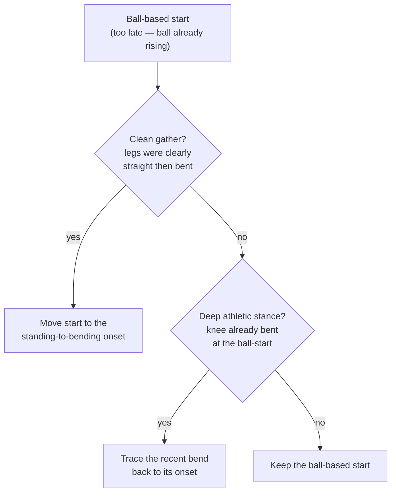
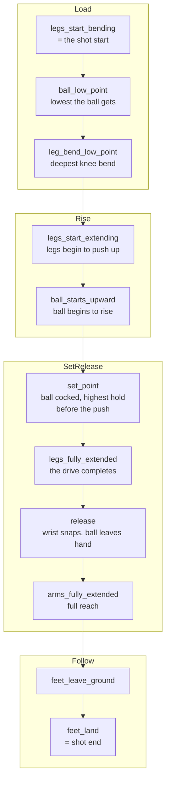
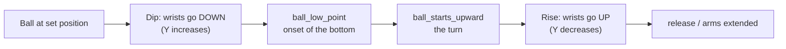
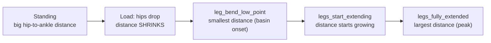
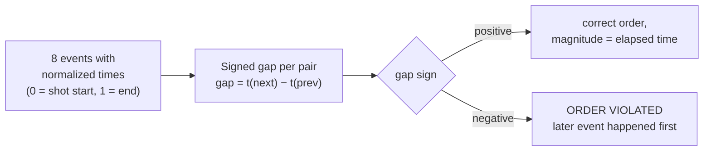
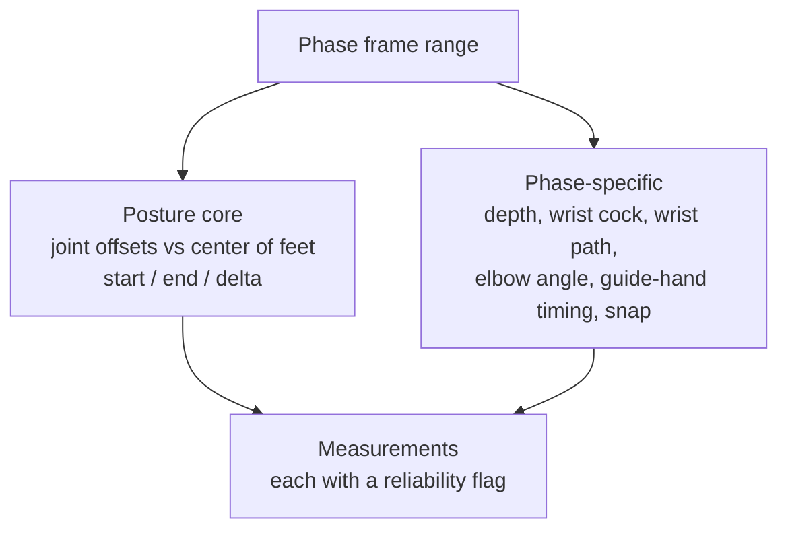
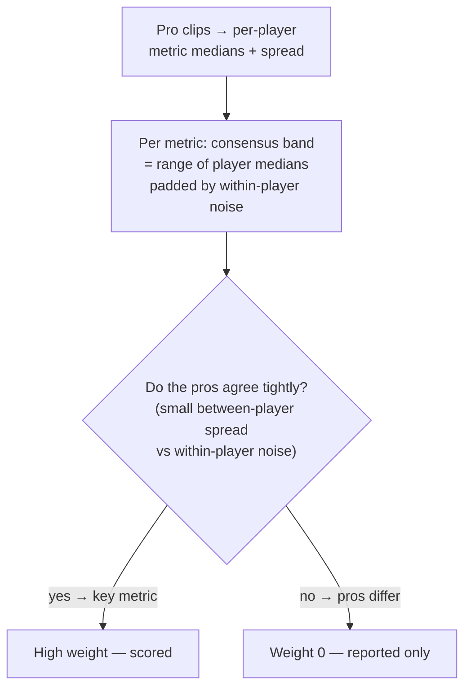
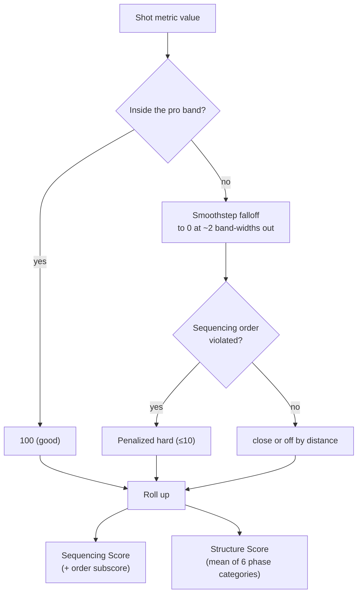

# Shot detection & analysis, in plain language

How ShotCoach turns a stream of body poses into detected shots, keyframes, and
scores — explained step by step with diagrams. This is the "what the algorithm
actually does" companion to the higher-level [architecture](./architecture.md).

Everything here runs on **pose landmarks** only: 33 body points per frame
(nose, shoulders, elbows, wrists, hands, hips, knees, ankles…), each with an
x/y position and a visibility score. MediaPipe produces them; none of the logic
below needs the raw video.

- [1. The whole pipeline](#1-the-whole-pipeline)
- [2. Finding shots (boundary detection)](#2-finding-shots-boundary-detection)
- [3. Finding keyframes inside a shot](#3-finding-keyframes-inside-a-shot)
- [4. The two key signals: wrist height and hip drop](#4-the-two-key-signals-wrist-height-and-hip-drop)
- [5. From keyframes to metrics](#5-from-keyframes-to-metrics)
- [6. From metrics to a score](#6-from-metrics-to-a-score)

---

## 1. The whole pipeline

A clip of poses becomes one or more scored shots through a fixed sequence of
stages. Each stage only depends on the stage before it.

Key idea: **keyframes are the backbone.** Almost every metric is either "when
did keyframe X happen" (sequencing) or "what did the body look like between
keyframes X and Y" (structure).

---

## 2. Finding shots (boundary detection)

A clip may contain several shots with gaps between them. The detector scans the
wrist height over time and looks for the signature of a shot: the ball (hands)
travels **up** far enough, fast enough, and ends up **above the shoulders**.

**Why refine the start?** The upward-motion signal fires when the ball is
already rising — _after_ the player has dipped into their shot. The true start
is the **gather**: when the legs begin to bend. So the detector walks backward
from the ball's upward motion to find where the legs started dropping.

This two-strategy start refinement is why boundary-start accuracy on side-view
clips is ~89% within a couple of frames. Code: `src/detection/shot-detector.ts`
(`findBoundaries`, `cleanGatherStart`, `deepStanceStart`).

---

## 3. Finding keyframes inside a shot

Within one shot the detector finds **11 keyframes** — the moments coaches care
about. They're found in dependency order: later ones search forward from
earlier ones.

Each keyframe is found from a specific signal:

| Keyframe                          | Plain-language rule                                                                                                                                                                |
| --------------------------------- | ---------------------------------------------------------------------------------------------------------------------------------------------------------------------------------- |
| `ball_low_point`                  | The **onset** of the dip's bottom — first frame the wrists reach near their lowest (highest Y). Taking the onset, not the deepest single frame, avoids landing late on a flat dip. |
| `ball_starts_upward`              | The **bottom of the dip** — where the wrists stop descending and turn upward.                                                                                                      |
| `leg_bend_low_point`              | The deepest knee bend, read from the **hip drop** signal (see §4) on the most-visible leg.                                                                                         |
| `legs_start_extending`            | Where the hips begin rising again after the deepest bend.                                                                                                                          |
| `set_point`                       | The highest, most-cocked hold of the ball before the forward push — detected from the shooting elbow's flex, not raw wrist height.                                                 |
| `legs_fully_extended`             | The **peak** of the hip-drop signal — hips highest relative to the ankles (the drive complete).                                                                                    |
| `release`                         | Maximum wrist flexion ("snap") after the set point. Treated as a _range_ through arm extension when scored.                                                                        |
| `arms_fully_extended`             | Maximum arm reach after release.                                                                                                                                                   |
| `feet_leave_ground` / `feet_land` | Ankle height crossing a ground baseline.                                                                                                                                           |

Code: `src/keyframe-detector.ts`; wired into phases in
`src/detection/keyframe-phases.ts`.

---

## 4. The two key signals: wrist height and hip drop

Two derived signals do most of the work. Understanding them explains most of the
keyframe rules.

### Wrist height (the ball)

The hands hold the ball, so the average wrist **Y** is a proxy for ball height.
Remember image coordinates: **Y grows downward**, so a _lower_ ball has a
_higher_ Y.

### Hip drop (the legs)

Knee _angle_ is noisy in side views because the far leg is occluded and
MediaPipe fabricates a near-straight angle for it. So instead of knee angle we
use the **vertical distance from hip to ankle** on the most-visible leg: it
shrinks as the legs bend and grows as they extend. This one change lifted
leg-keyframe accuracy substantially.

Both signals share the same trick: find a **basin** (a valley or a peak) and
take its _onset_ or its _turn_ rather than the single most-extreme frame, which
is noisy. The `HIP_DROP_MIN_RANGE` gate falls back to knee angle when the hips
barely move (e.g. synthetic tests, or a view where hips/ankles aren't tracked).

---

## 5. From keyframes to metrics

Two families of metric come out of the keyframes and the poses between them.
Code: `src/metrics/v2/`.

### Sequencing (efficiency) — order and timing

Take the 8 shot events, express each event's time as a fraction of the shot, and
measure the **signed gap** between each consecutive pair.

One number captures both "must happen before X" (the sign) and "within a time
range" (the magnitude). Example: _ball must start rising before the legs reach
their lowest_ becomes one signed gap that should be positive and not too large.

### Structure — body mechanics per phase

For each phase (Gather, Load, Rise, Set Point, Release, Follow-through) measure
body shape. The reusable core is **posture**: the horizontal offset of head /
shoulders / hips / knees / ankles from the **center of the feet**, at the phase
start, the phase end, and the change between them.

Everything is **normalized** so camera zoom and player size cancel out:
distances divide by a body-scale estimate (nose-to-ankle span), times divide by
shot duration. Anything that can't be measured reliably (wrong camera angle,
occluded landmarks, missing keyframe) is returned **unavailable** — never
guessed.

---

## 6. From metrics to a score

Metrics are scored against **thresholds** derived from pro reference clips.

### Deriving thresholds (offline, from pro clips)

The insight: a metric where **every pro lands in a narrow band** is a truly key
element of good shooting; a metric where pros legitimately differ (e.g. exact
set-point height) shouldn't be scored. Code: `src/metrics/v2/thresholds.ts`.

### Scoring a shot

Unreliable, missing, and reported-only metrics don't affect the score; the
**measured fraction** is surfaced so the UI is honest about gaps ("scored on 14
of 19 metrics — side view needed for the rest"). Code: `src/scoring/v2/`.

---

## Where to look in the code

| Concern                            | File                                                      |
| ---------------------------------- | --------------------------------------------------------- |
| Shot boundaries + start refinement | `src/detection/shot-detector.ts`                          |
| Keyframe detection                 | `src/keyframe-detector.ts`                                |
| Keyframes → phases                 | `src/detection/keyframe-phases.ts`                        |
| Sequencing metrics                 | `src/metrics/v2/sequencing.ts`                            |
| Structure metrics                  | `src/metrics/v2/structure/`                               |
| Normalization primitives           | `src/metrics/v2/normalize.ts`                             |
| Single extraction entry point      | `src/metrics/v2/extract.ts`                               |
| Threshold derivation               | `src/metrics/v2/thresholds.ts`                            |
| Scoring engine                     | `src/scoring/v2/index.ts`                                 |
| Validate detection vs labels       | `src/testing/tolerance-report.ts` (`npm run test:labels`) |
